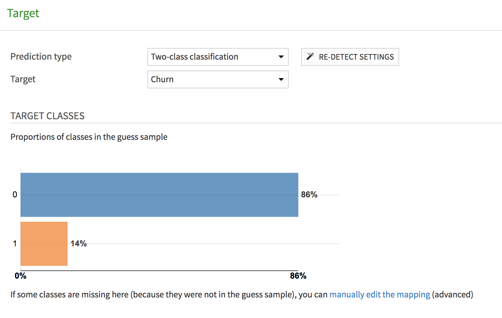
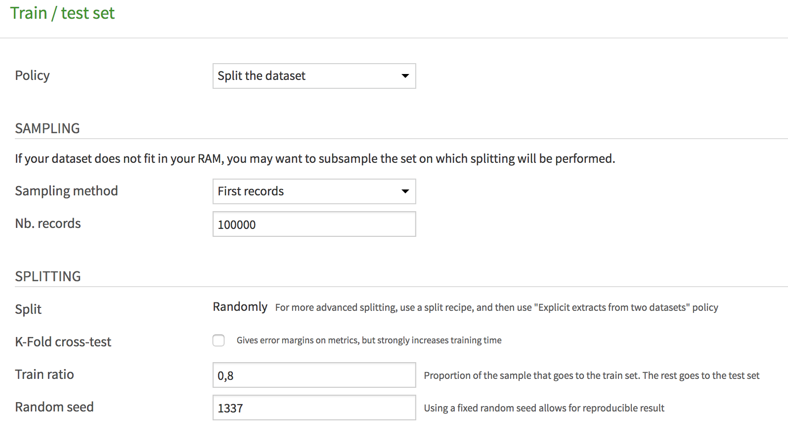
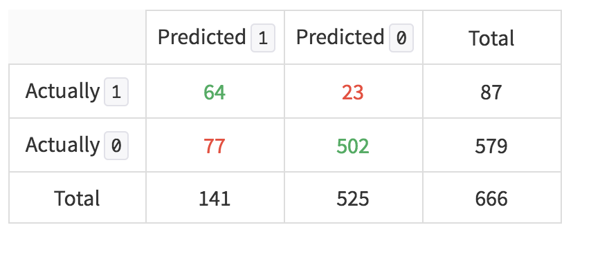
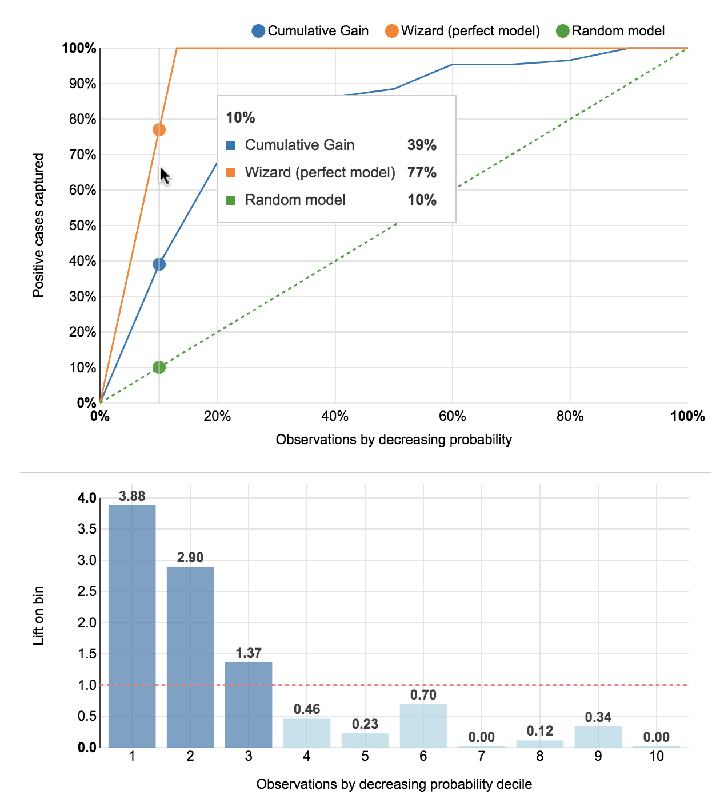
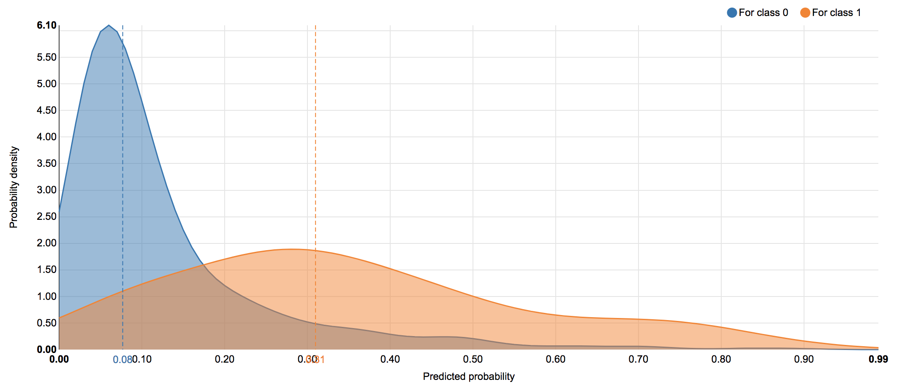
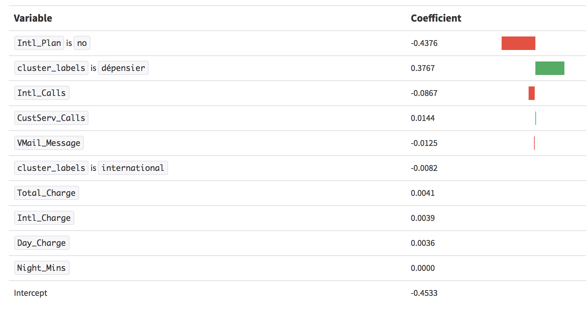
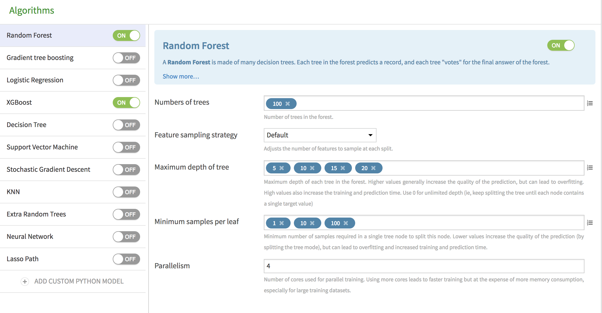
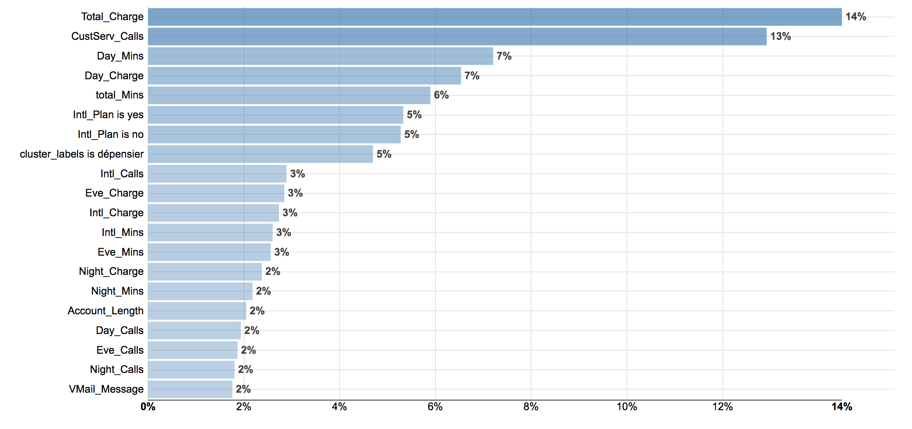

# Prédiction de l'attrition
Dans ce cas pratique, nous allons entrainer un modèle supervisé pour prédire si un client est susceptible de résilier son abonnement (*churn prediction*). Cela permettra de définir des actions marketing afin de retenir ces clients.

Le dataset utilisé sera `telco_customers_scored`. 

**Note** : ce cas pratique peut être réalisé à la suite du cas pratique [Segmentation de clientèle par clustering](customer_clustering_fr.html) ou bien directement. Dans ce dernier cas, remplacer le dataset `telco_customers_scored` par `telco_customers` (sans les clusters).

## Prédiction avec un modèle linéaire

Le premier modèle de prédiction étudié est un modèle linéaire. Ce modèle suppose que le churn peut être prédit par une combinaison linéaire des variables explicatives (features). Bien que simpliste, ce modèle donne souvent de bons résultats et consitue généralement un modèle de référence (*baseline*). Il n'est pas adapté quand 

* la variable a prédire dépend de combinaison non linéaire des features; 
* les variables explicatives sont corrélées;
* le nombre de variables explicative est très grand ; il faut alors sélectionner les variables.

> * Pour notre cas de prédiction de *Churn*, le modèle vous semble-t-il adapté ?

Même si le modèle n'est pas adapté, nous allons réaliser un entrainement pour voir les différents paramètres sur un modèle simple : 

> * Visuliser le dataset `telco_customers_scored`
> * Cliquer sur *LAB*, *Visual Analysis* puis *QUICK MODEL* et *Prediction*
> * Choisir la variable à prédire : *Churn* puis *Simple Formula* puis *Create*

Une fois le modèle créé, aller dans *DESIGN* puis *Target*. Nous voyons une analyse de la distribution des clients dans les deux classes : Churn/NoChurn

  

 

Nous avons un problème avec des classes déballancée : il y a beaucoup moins de Churn que de NoChurn. Mais c'est la prédiction de Churn qui nous intéresse, il faudra donc se focaliser sur la classe minoritaire.

Dans la section *Train / Test Set*, nous voyons les paramètres de découpage des données. Pour estimer la qualité du modèle, il faut utiliser un ensemble différent de l'ensemble d'entrainement. C'est le *test set*

  

Dans notre cas, 80% des données sont utilisées pour l'entrainement et 20% pour l'esimtation de la qualité du modèle.

Dans la section *Features handling*, nous voyons que certaines variables n'ont pas été sélectionnées : par exemple *State* a été désactivée car cette variable semblait avoir trop de modalités (*DSS rejected this feature because it had too many categories for the task at hand*)

Dans la section *Algorithms*, un seul algorithme a été sélectionné, *Lasso Path*. Lancer l'entrainement du modèle avec le bouton vert *TRAIN*. Une fois le modèle entrainé, Cliquer dessus pour voir les résultats. L'accuracy du modèle doit être à 0.85, ce qui signifie que le modèle fait 15% d'erreur lors de la prédiction Churn/NoChurn sur de nouvelles données. Cependant, il faut regarder plus en détail car seul la préduction du Churn nous intéresse.

> Cliquer sur *PERFORMANCE / Confusion matrix*

Cette page présente une analyse détaillée des performances et en particulier la matrice de confusion : 

  

Cette matrice nous indique que sur 666 exemples de test, 502 exemples qui n'était pas en Churn ont été correctement classifiés, ainsi que 64 exemples qui étaient en Churn. 77 exemples ont été prédits à tord comme en Churn (faux positifs) et 23 exemples n'ont pas été prédit en Churn alors qu'ils auraient dû l'être (faux négatifs). On voit donc que notre modèle prédit 64 Churn sur les 87 à détecter ce qui est bien, mais avec une proportion de faux positifs assez élevée (77, plus quel es 64 vrais positif). Pour être certain de bien détecter le Churn, notre modèles en prédits plus que la réalité.

> Cliquer sur *PERFORMANCE / Lift charts*

Dans le cas de la détection de Churn, nous voulons concentrer notre action sur les clients les plus susceptibles de résillier notre abonnement et cibler les dépenses markeing sur ces clients. Sans modèle de prédiction, les clients cibles seraient tirés au hasard dans la base client. Le modèle de référence est donc un modèle aléatoire (*random model*). Avec notre modèle de prédiction, nous voulons savoir si nous pouvons prédire mieux que l'aléatoire les clients à cibler. Cette mesure est donnée par la courbe lift.

  

Les courbes lift donnent le gain par rapport à l'aléatoire par décile : sur notre exemple, sur les 10% des Churn les plus probables, notre modèle prédit 3.88 fois mieux que l'aléatoire, ce qui est un bon score. Nous pourrions donc concentrer les campagnes marketing sur ces clients.

Il est aussi possible d'analyser le modèle lui-même, par exemple dans quelle mesure il est capable de séparer les deux classes Churn/NoChurn. 

> Cliquer sur *PERFORMANCE / Density chart*

  

Nous voyons la distribution des exemples selon le score prédit. Pour la classe 1, le score doit être proche de 1 alors que pour la classe 0, le score doit être proche de 0. Dans l'idéal, les deux classes sont bien séparées et on peut déterminer un seuil de décision. Dans notre cas, les deux distributions se recouvrent beaucoup mais on peut mettre un seuil pour ne détecter que des Churn.

Enfin, nous pouvons analyser l'apport de chaque variable dans la décision du modèle :

> Cliquer sur *INTERPRETATION / Regression coefficients*

  

Nous voyons ici que la variable la plus importante est `Intl_Plan is no`, qui vote pour la classe NoChurn puis la variable `cluster_labels is dépensier` qui votre pour la classe Churn.

## Optimisation des modèles de prédiction

Dans cette section, nous allons recherche le meilleur modèle pour la prédiction du Churn.

> * Visuliser le dataset `telco_customers_scored`
> * Cliquer sur *LAB*, *Visual Analysis* puis *QUICK MODEL* et *Prediction*
> * Choisir la variable à prédire : *Churn* puis *Performance* puis *Create*
> * Une fois l'expérience créee, aller dans *DESIGN* puis *Algorithms*

  

Pour cette expérience, deux modèles ont été sélectionés : RandomForest et XGBoost. Ces sont actuellement les modèles qui donnent le plus souvent les meilleures performances. Ceoendant, dans le cas où les données d'apprentissage sont disponibles en très grandes quantité, des réseaux de neurones profonds (*DeepLearning*) peuvent alors donner de meilleurs résultats.

Pour trouver le meilleur algorithme, il faut tester plusieurs valeurs pour les paramètres. Dans notre cas, pour le modèle de RandomForest, on va tester plusieurs valeurs pour *Maximum depth of tree* et pour *Minimum samples per leaf* et idem pour le modème XGBoost. Cela implique dont l'apprentissage et l'évaluation d'un grand nombre de modèles. 

> * Lancer l'entrainement avec le bouton vert *TRAIN*

Un message indique que  338 modèles vont être entraînés et évalués. Le meilleur modèle est un modèle de random Forest avec une *accuracy* de 97%.

> * Cliquer sur le modèle pour l'explorer
> * Sélectionner *PERFORMANCE / Confusion matrix* 

La matrice de confusion est bien meilleure que pour le modèle linéaire.

> * Sur les 666 exemples de tests, combien d'exemples ne sont pas correctement classifiés ? Retrouvez-vous l'*accuracy* de 97% ?

Examinons la courbe de lift 

> * Sélectionner *PERFORMANCE / Lift charts*
> * Quelle est la valeur de la lift pour le premier décile ?

Examinons la distribution des scores : 

> * Sélectionner sur *PERFORMANCE / Density chart* ; 
> * Notez que les distributions sont mieux séparées que pour le modèle linéaire.

Examinons les variables les plus importantes : 

> * Sélectionner sur *INTERPRETATION / Variables importance* ; 

  

Un modèle RandomForest est composé de nombreux arbres de décision participant à la décision finale par un vote pondéré. Il n'est donc pas aisé d'examiner chacun des arbres. Par contre, il est possible de visualiser quelles sont les variables les plus utilisées et les plus importantes pour l'ensemble des arbres. Dans notre cas, la variable la plus importante est `Total_Charge`, suivie de `CustServ_Calls`. 

