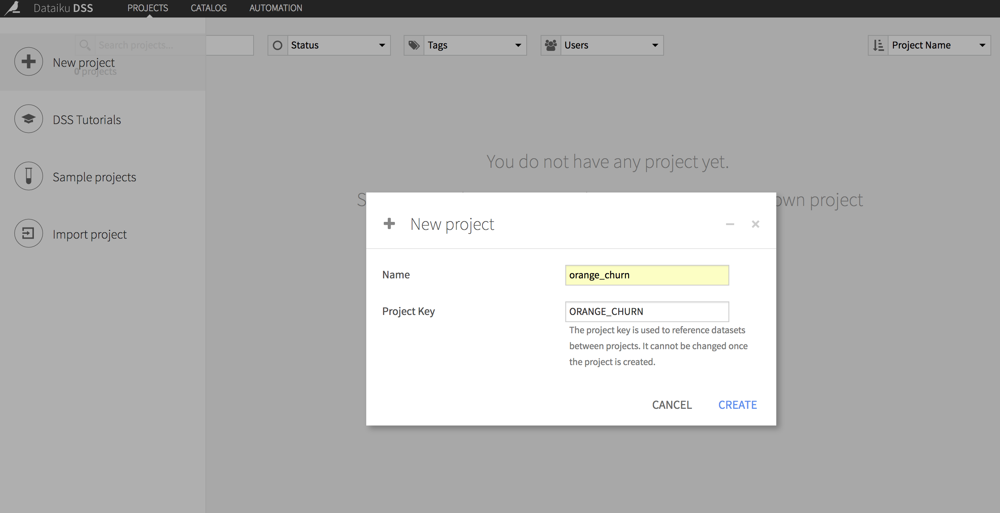
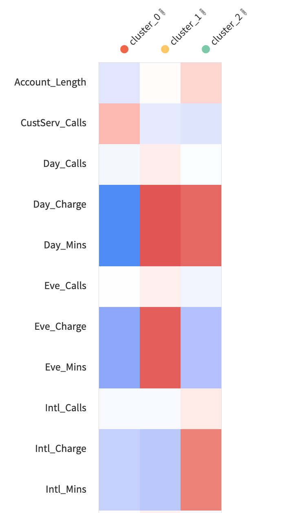

# Segmentation de clientèle par clustering

La segmentation de clientèle est un cas d'usage des algorithmes de partitionnement ou  *clustering*  en anglais. 

> Attention, en français dans la communauté d'analyse de données, on parle aussi d'algorithmes de classification pour le partitionnement, donc non supervisé, alors que dans la communauté de l'apprentissage automatique (Machine Learning), on réserve le terme de classification pour la classification supervisée.
> 
> 
>  Type  | Apprentissage automatique | Analyse de données 
> ---|--------|-------
> non supervisé | clustering/partitionnement | classification
> supervisé | classification | classement 

## Partitionnement d'une base de client Telecom

La base Telecom contient la description de 3333 clients d'une société de télécom fictive. C'est base n'est pas réelle mais reprends des caractéristiques de clients réalistes : 

* State : état d'origine du client (US)
* Area_Code : indicatof téléphonique
* Phone : numéro de téléphone	
* Account_Length	: 
* Intl_Plan : option appels internationau
* VMail_Plan	: option messagerie
* VMail_Message	: nombre de messages en messagerie
* Day_Mins ; Day_Calls ; Day_Charge : nombre de minutes/nombres d'appels/montant des appels en journée
* Eve_Mins ; Eve_Calls ; Eve_Charge: nombre de minutes/nombres d'appels/montant des appels en soirée
* Night_Mins	; Night_Calls	 ; Night_Charge : nombre de minutes/nombres d'appels/montant des appels la nuit 	
* Intl_Mins ; Intl_Calls ; Intl_Charge :  nombre de minutes/nombres d'appels/montant des appels à l'international 	
* Total_Mins : nombre total de minutes d'appels
* Total_Charge : montant total des appels
* CustServ_Calls : nombre d'appels au service clientèle
* Churn : attrition

### Chargement du Dataset

* Créer un nouveau projet "orange churn" en cliquant sur le "+"

  

* Cliquer sur "+ Import your first dataset"
* Choisir "Files/upload your files"
* Glisser/déposer le fichier "telco_customers.xlsx"

Vous devez avoir un message vous indiquant que le format est "excel" et que 23 colonnes ont été détectée. Vous pouvez vérifier les données avec "Preview". Si tout semble OK, cliquer sur "Create"  en haut à droite.

Les colonnes sont analysées et le type est détecté : US state, integer, text, decimal, boolean.	

  

La dernière colonne "Churn" contient une variable indicatrice d'un client ayant résilié son abonnement : c'est donc une variable booléenne, il faut la convertir en cliquant sur son type *Integer*

  

### Clustering des données

* cliquer sur "Lab" (bouton bleu en haut à droite), puis *Quick model* et *Clustering*

  

* Vérifier que *K-Means* est sélectionné et cliquer sur *Create*

#### Sélection des paramètres du clustering

Afin d'appliquer l'algorithme de clutering, il faut choisir : 

* Quelles caractéristiques (*features*) sont utilisées pour décrire les individus ?
* Quel algorithme de clustering choisir ?
* Combien de clusters sont attendus ?

**Sélection des caractéristiques**

Certaines caractéristiques ne sont pas pertinantes pour regrouper les clients, il est possible de les desactiver : 

* Choisir *DESIGN* puis *Features handling* et desactiver *State, Area code, Phone* et *Churn*

**Sélection de l'algorithme**

En première approche, nous allons utiliser l'algorithme  le plus courant : *KMeans*. 

> Sélectionner l'algorithme KMean et desactiver les autres algorithmes

**Sélection du nombre de clusters**

En général, on ne connait pas à l'avance le nombre de clusters dans les données. Il faut donc tester plusieurs valeur et évaluer chaque resultat. Cette procédure étant assez fastidieuse, il ne faut pas choisir un nombre de cluster trop important. 

> Indiquer 3 pour la valeur *Number of clusters*, puis cliquer sur *Train* (bouton vert en haut à droite). Une fois le clustering terminé (cela prend quelques secondes), cliquer que le résultat *KMeans (k=3)*

  

#### Analyse des clusters

L'analyse de la qualité des clusters ne peut pas être totalement automatisée. S'il existe des métriques de qualités de cluster (par exemple le coefficient [Silhouette](http://scikit-learn.org/stable/auto_examples/cluster/plot_kmeans_silhouette_analysis.html) ), il faut explorer manuellement les clusters pour évaluer si les paramètres et en particulier si le nombre de clusters choisi sont adaptés aux données.

* Afin d'analyse les cluster, nous allons utiliser une représentation en *heatmap*. 

> Après avoir cliqué sur *KMeans (k=3)*, sélectionner *heatmap*  dans la section Clusters.

La *heatmap*  indique pour chaque cluster les caractéristiques des éléments du cluster pour cette variable : le bleu indique une moyenne des éléments du cluster inférieure à la moyenne générale, le rouge une moyenne des éléments du cluster supérieure à la moyenne générale. On peut donc interprêter les clusters : 

Sur l'illustration ci-dessous 
* le cluster 0 regroupe les clients effectuant peu d'appels
* le cluster 1 regroupe les clients qui appellent beaucoup mais pas à l'international
* le cluster 2 regroupe les clients qui appellent à l'international

  

Une autre visualisation pour l'analyse des clusters est *cluster profiles* qui présente les distributions des valeurs pour chaque variable par cluster : 

  

On voit sur cet exemple que le cluster0 a une distribution inférieure à la moyenne pour la variable *Day_Charge*.

> Réaliser un nouveau clustering avec l'algorithme KMeans  en testant des valeurs de nombre de cluster de 3 à 10

  

> * Observer que la valeur du coefficient de silhouette ne varie pas beaucoup et ne permet pas réellement de choisir le nombre de cluster optimal
> * Choisir KMeans (k=6) et identifier le contenu des différents clusters en utilisant la *heatmap*

