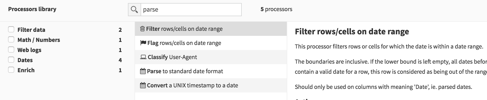
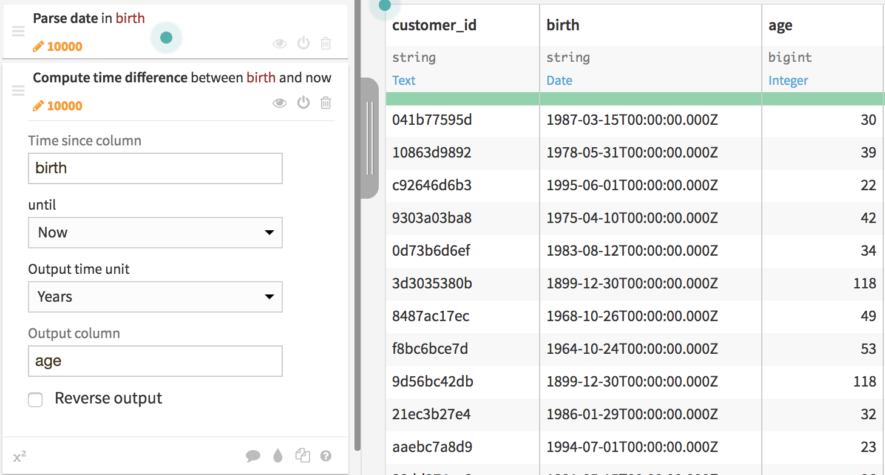
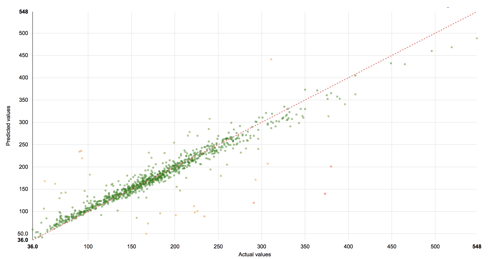

# Prédiction du revenu associé à un client

Dans ce cas pratique, nous allons mettre au point un modèle permettant de prédire le revenu associé à un client. Pour ce faire, nous allons d'abord opérer des transformations sur les données brutes et associer des données venant de plusieurs bases :

* une base CRM contenant les données clients
* une base WEB contenant l'historique d'activité web des clients
* une base GDP contenant des données génériques de revenus par pays

## Préparation de la base CRM

>* Créer un nouveau projet *Customer_value*
>* Télécharger la base [`crm_last_year.csv`](../data/crm_last_year.csv) et l'ajouter au projet (Dataset / New Dataset / Upload your file puis glisser/déposer le fichier CSV).
>* Sélectionner le dataset "crm\_last_year" puis dans le menu *ACTION* sélectionner  *Visual Recipes / Prepare*.

Cette action crée un nouveau dataset sur lequel nous allons appliquer des transformations. Pour ajouter une nouvelle étape de préparation, cliquer sur *+ ADD A NEW STEP* et rechercher la transformation souhaitée avec le champ de recherche.

  

>* Ajouter une étape de normalisation de date : recherche la transformation *Parse to standard date format* : appliquer sur la colonne *birth* avec le format `MM/dd/yyyy` 
>* Ajouter une étape pour calculer l'âge du client : sélectionner *Compute difference between dates* avec les paramètres *Time since column* = birth, *Output time unit* = year et *Output column* = age

  

Nous allons maintenant fusionner la base CRM et la base WEB en prenant comme pivot de fusion l'identifiant client.

>* Télécharger la base [`web_last_year.csv`](../data/web_last_year.csv) et l'ajouter au projet (Dataset / New Dataset / Upload your file puis glisser/déposer le fichier CSV).
>* Revenir sur l'étape de préparation (par exemple en passant par la visualisation du workflow)
>* Ajouter une étape *Join with other dataset* avec les paramètres : 
>  * *join column* = customer_id
>  * *dataset to join with* = web\_last_year
>  * *join_column* = customer\_id
>  * *columns to retrieve* : ip, page_visited, campaign
>  * *Prefix* = join\_

Cette étape ajoute 3 colonnes à la base de client avec les données venant de la base Web. Nous allons maintenant géolocaliser les clients.

>* Ajouter une étape *Resolve GeoIP*  avec les paramètres *IP column* = join_ip et *prefix* = geo\_ . Cocher uniquement *Extract country* car seule cette information nous intéresse.

Cette étape ajoute une colonne *geo_country*. Nous allons maintenant utiliser cette nouvelle colonne pour ajouter une donnée générique liée au pays du client,  le PIB par habitant.

>* Télécharger la base [`country_gdp.csv`](../data/country_gdp.csv) et l'ajouter au projet (Dataset / New Dataset / Upload your file puis glisser/déposer le fichier CSV).
>* Revenir sur l'étape de préparation
>* Ajouter une étape *Fuzzy Join with other dataset*  (car les noms de pays ne sont pas exactement identiques) avec les paramètres : 
>  * *join column* = geo_country
>  * *dataset to join with* = country_gdp
>  * *join_column* = Country
>  * *columns to retrieve* : GDP_cap
>  * *Prefix* = join\_
>  * cocher *Normalize text* pour normaliser les noms de pays.
>* Lancer les traitements avec le bouton vert *RUN*

Ces traitements créent un nouveau dataset `crm_last_year_prepared` sur lequel nous allons entrainer notre modèle de prédiction du revenu.

## Entrainement du modèle de prédiction du revenu

L'objectif est de prédire le revenu associé à un nouveau client étant données les diverses informations collectées dans les bases CRM, WEB et GDP. Comme la variable à prédire est une une variable quantitative (le revenu en euro), la tâche est supervisée et de type régression.

>* Créer une expérience  de prédiction : bouton *LAB* puis *QUICK MODEL* puis *PREDICTION*. 
>* Choisissez *revenue* pour la variable à prédire et le template *Balanced*

Dans la section *DESIGN* puis *Target* vous pouvez vérifier que le type de prédiction détecté est bien une régression.

Certaines variables ne sont pas utiles pour la prédiction, vous pouvez les supprimer : 

>* Dans la section *Features / Features handling*, vous pouvez supprimer *IP* et *birth* puis lancer l'entraînement (*TRAIN*)

L'expérience compare un modèle linéaire (Ridge Regression) et un modèle par forêts aléatoires (RandomForest). Le meilleur modèle est la forêt aléatoire avec un [coefficient R2](https://en.wikipedia.org/wiki/Coefficient_of_determination) 0.89. 

>* Sélectionner le modèle par RandomForest
>* Sélectionner la visualisation de l'importance des variables dans la prédiction *Variables importance*. Quelles sont les variables les plus importantes pour prédire le revenu associé à un client ?
>* Sélectionner la visualisation *Scatter plot*. Cette visualisation permet de voir la valeur prédite par rapport à la vraie valeur. Si les deux sont identiques, le point se situe sur la diagonale. 
  

  

On note une proximité des points avec la diagonale mais certains points en sont assez éloigné. Pour améliorer le modèle, il faudrait analyser les points éloignés pour comprendre la cause des erreurs.