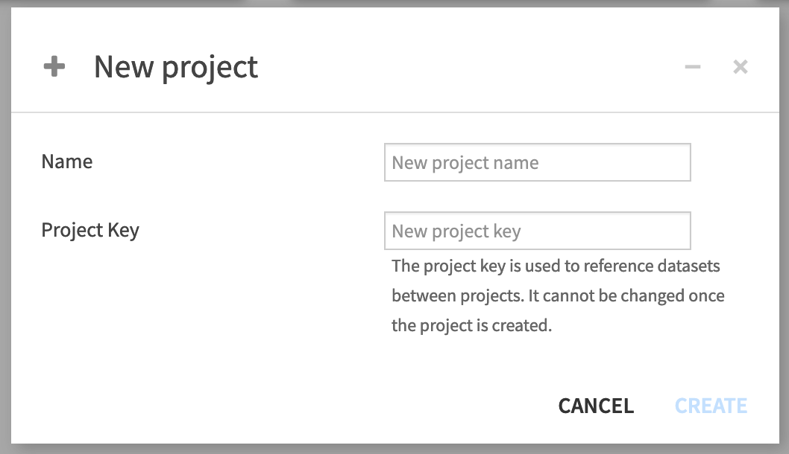
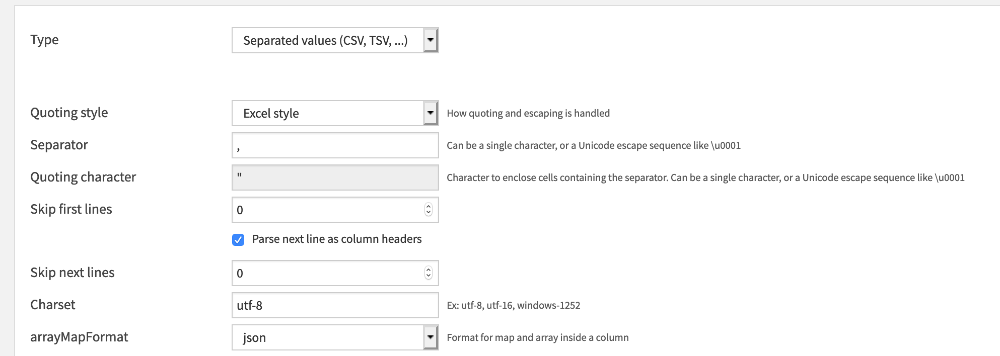
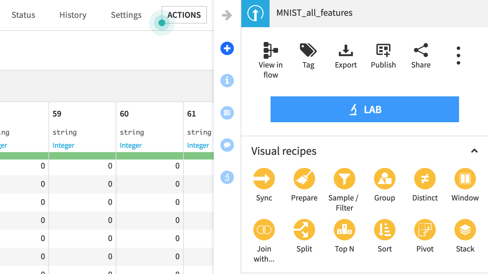
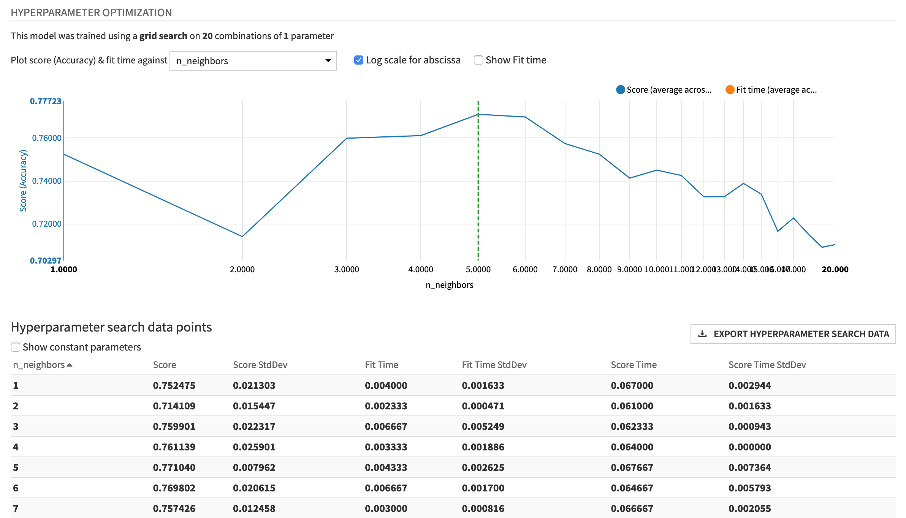

# Classification des images de chiffres manuscrits de la base MNIST

Dans ce cas pratique nous allons étudier plusieurs méthodes pour la classification d'images de chiffres manuscrits de la base MNIST. Cette base est très utilisée dans la communauté au point d'être considéré comme la *Drosophile du Machine Learning* (citation attribuée à Geoffrey Hinton). Cette base est un problème jouet sans être trop simple. Elle comporte 10 classes (les chiffres de 0 à 9) et 60 000 d'exemples, ce qui est beaucoup étant donné la simplicité du problème.

  

Les images originales sont toutes de la même taille (28x28 pixels), les chiffres sont centrés dans l'image et il n'y a pas de bruit.

Nous allons travailler sur une version réduite en 8x8 pixels, disponible [ici](http://data.teklia.com/ml-course/MNIST_all_features.csv.zip).

Connectez-vous à Dataiku avec votre nom d'utilisateur et votre mot de passe.

Créez un nouveau projet  :

  

Aller dans le menu "dataset" et cliquer sur "Import your first dataset", puis "Files", "Upload you files". Ajouter le fichier MNIST_all_features.csv.gz.

  

Une fois le fichier téléchargé, cliquer sur "PREVIEW", sélectionner l'option "Parse next line as column headers" (pour utiliser la première ligne du fichier comme nom des colonnes), puis "Create".

  

Une fois le dataset créé, changer le type de la dernière colonne (la renommer en "class" si besoin) de "Integer" en "Text".

## Entrainement des classifieurs

Dans le dataset "MNIST_all_features", cliquer sur "LAB" 

  

puis, "AutoML	 prediction", sélectionner la variable target "Class",  puis "Quick Prototype" et finalier par "Create".	

Aller dans le menu DESIGN :
* dans l'onglet target, vérifier la distribution des classes, la classe cible et le type de prédiction qui doit être *multiclass classification*.
*  dans "Train/test", faites un sampling des 1000 premiers exemples pour aller plus vite lors de l'entrainement.
*  dans "Features handling", réactiver toutes les features
*  dans algorithme sélectionner kNN
*  Tester des valeurs de k de 1 à 20
*  Dans "Basic/Metrics", choisir la métrique "Accuracy"
*  Cliquer sur TRAIN

Une fois le modèle entrainé, cliquer sur le modèle et aller dans l'onglet "Hyperparameter optimization". Vous devez voir un graphique comme 

  

>* Quelle est la meilleur valeur de k ?
>* Quelle est la meilleure accuracy ?

Revenir au menu DESIGN et augmenter le nombre d'exemples à 10000. Relancer l'apprentissage.

>* Quelle est la meilleur valeur de k ?
>* Quelle est la meilleure accuracy ?

Aller dans l'onglet "Confusion matrix".

>* Quelles sont les classes les mieux classifiées ?
>* Quelles sont les classes les moins bien classifiées ? Avec quelles autres classes sont-elle confondues.

Revenir au menu DESIGN et augmenter le nombre d'exemples à 60000 et tester avec le meilleure valeur de k obtenue précédemment. Relancer l'apprentissage. Noter l'augmentation du temps de l'expériences et l'augmentation des performance *"There is no better data than more data"*.

Réduire à 10 000 exemples :

>* Tester un classifieur par régression logistique (Logistic Regression) avec les paramètres par défaut
>* Tester un classifieur SVM (Support Vector Machine) avec les paramètres par défaut
> Quel est votre meilleur model obtenu, avec quelle performance ?
	