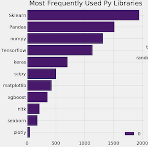

# Introduction to Machine Learning in python

These practical examples provide an introduction to Machine Learning in python. They are based on Python3, jupyter, [scitkit-learn](http://scikit-learn.org/), [pandas](http://pandas.pydata.org/), [seaborn](https://seaborn.pydata.org/). As shown in [Kaggle 2017 survey](https://www.kaggle.com/ash316/novice-to-grandmaster), these libraries are widely used by data scientists :

They allow to cover the whole process of machine learning or data science projects : 

* load the data from files in [many formats](http://pandas.pydata.org/pandas-docs/stable/io.html)  with **pandas**
* [visualize and check](https://seaborn.pydata.org/tutorial/distributions.html#visualizing-pairwise-relationships-in-a-dataset) the data with **seaborn** 
* [select, transform filter the data ](http://pandas.pydata.org/pandas-docs/stable/indexing.html) with **pandas**
* [split the data in train/dev/test sets](http://scikit-learn.org/stable/modules/generated/sklearn.model_selection.train_test_split.html) with **scikit-learn**
* apply [many types of  machine learning algorithms](http://scikit-learn.org/stable/) with **scikit-learn**
* [evaluate and analyse the results](http://scikit-learn.org/stable/modules/model_evaluation.html#model-evaluation) with **scikit-learn**
* visualize  the results and make reports with **seaborn** 

These library are open source and commercially usable - BSD license

**Practical examples**

* [k-Nearest Neighbors](python/kNN.html) : Neighbors classifier. 
 * a simple excercise on 10 data points in 2D
 * image classification on the classical MNIST dataset with k-Nearest 
* [Logistic Regression](python/logistic_regression.html) : image classification on MNIST and training/testing curves.
* [Naive Bayes](python/naivebayes_text.html) : text classification with Naive Bayes.
* [Decsison Trees](python/decision_trees.html)
* [SVM](python/svm.html) : hyperparameter optimization for image classification on MNIST
