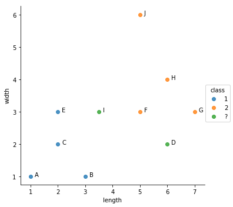
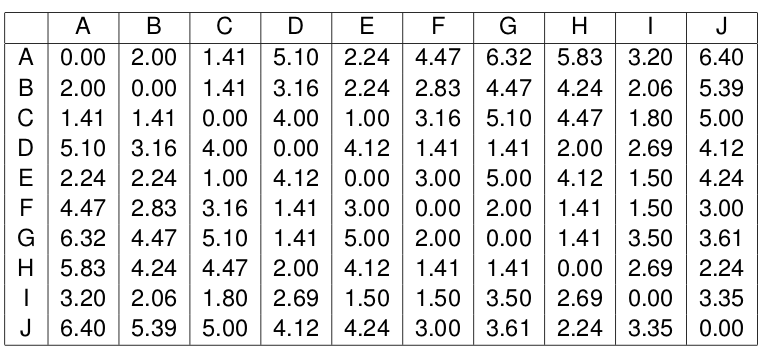

# kNN

The kNN algorithm is a simple and intuitive template based algorithm for classification.

## Exercise


You need to classify objects on which you have measured length and width. The following objetcs have already been measured : 
 
A(1,1), B(3,1), C(2,2), D(6,2), E(2,3), F(5,3), G(7,3), H(6,4), I(3.5,3), J(5,6)

The classes of the points are the following : 

* classe 1 : A,B,C and E
* classe 2 : F, G, H, and J



 
The distance between all the objects has been computed : 



**Question:**
> What is the predicted class for the points D and I using a kNN classifier with k=1 and for k= 2 ?
> 

## Code

The following code uses scikit-learn kNN to make the prediction : 

```
from sklearn.neighbors import KNeighborsClassifier
df = pd.DataFrame([[1,1.0,'1'],[3,1,'1'],[2,2,'1'],[2,3,'1'],[5,3,'2'],[7,3,'2'],[6,4,'2'],[5,6,'2'],[6,2,'?'],[3.5,3,'?']],
                  columns=['length','width','class'],
                  index=['A','B','C','E','F','G','H','J','D','I']
                 )
X_train = df[#INSERT DATA RANGE][[#INSERT COLUMN NAME]]
y_train = df[#INSERT DATA RANGE][[#INSERT COLUMN NAME]]
X_test = df[#INSERT DATA RANGE][[#INSERT COLUMN NAME]]
y_test = df[#INSERT DATA RANGE][[#INSERT COLUMN NAME]]
clf = KNeighborsClassifier(n_neighbors=2)
clf.fit(X_train,y_train)
clf.predict(X_test)

```
See the [KNN scikit-learn documentation](http://scikit-learn.org/stable/modules/generated/sklearn.neighbors.KNeighborsClassifier.html) for more details.

**Question :**

>  Replace `#INSERT DATA RANGE` and `#INSERT COLUMN NAME` and check that the predictions are the same as yours.
> 
>
>

## Experiment
