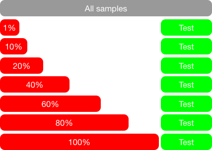
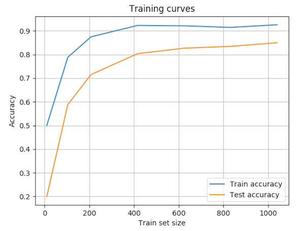
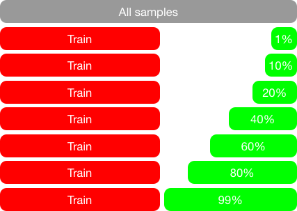
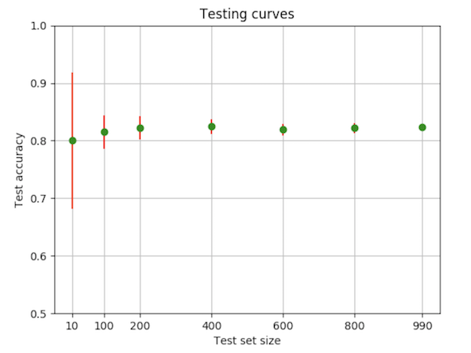

## Logistic regression

Another simple yet very effective classifier is the logisitic regression. This classifier is a version of the linear regression model adapted to classification. 

See this introduction to logistic regression by Andew Ng :

* [06.1-LogisticRegression-Classification](https://www.youtube.com/watch?v=LLx4diIP83I) 
* [06.2-LogisticRegression-HypothesisRepresentation](https://www.youtube.com/watch?v=tEk6ikTKGYU)
* [06 7 LogisticRegression MultiClassClassificationOneVsAll](https://www.youtube.com/watch?v=07bPqvCevfc)

And to go further : 

* [06.3-LogisticRegression-DecisionBoundary](https://www.youtube.com/watch?v=7F-CuXdTQ5k)
* [06.4-LogisticRegression-CostFunction](https://www.youtube.com/watch?v=IxotEG3yWHs)
* [06.5-LogisticRegression-SimplifiedCostFunctionAndGradientDescent](https://www.youtube.com/watch?v=Y2zXH_4_aZs)

**Question 7** : 

> Using the MNIST Data and train a [Logistic Regression](http://scikit-learn.org/stable/modules/generated/sklearn.linear_model.LogisticRegression.html) classifier (`clf = linear_model.LogisticRegression()`) on 80% and test on 20% of the samples. Report the accuracy and compare to the best result of the kNN classifier.

The accuracy of the classifiers depends on the size of the training set : the more data, the better accuracy. Will study the impact of the size of the training set on kNN and Logisitic Regression.

For this study, we first separate the data in train/test set with 80%/20% ratio. Then we train the classifier on an increasing training set corresponding to 1%, 10%, 20%, 40%, 60%, 80% and 100% of the original training set. We will always be tested on the same test set (the original one). The following Figure explains the different splits : 

  

**Question 8** : 

> * In the following questions, limit the experiments to 1300 random samples.
>
> * Report the training and test set accuracies for the 1NN, 2NN, kNN (k being the best value for `k` you previously found) and the Logisitic Regresstion. 
> * Plot the training curves on a plot similar to : 

  

You can use [pandas plot function](https://pandas.pydata.org/pandas-docs/stable/visualization.html#basic-plotting-plot).

When more data is available, not only the training of the classifier is improved, but the precision of the accuracy estimation on the test set is also improved if the size of the test set increases. To estimate the precision of the accuracy estimation on a test set, we must run several tests on different sets with the same size. Since the training set is constant, the classifier is trained only once for a given test set size. From the different test accuracy, we can compute the mean and the standard deviation of the test set accuracy. 

  

The pseudo-code for computing the test set mean and standard deviation is: 

    Train the classifier
    Loop with an increasing test set size
       Run 10 times 
          test the classifier on the test set
          store the test set accuracy
       Compute the test set mean acurracy and standard deviation of the accuracy

 

**Question 9** : 

> * Report the mean and standard deviation (use `np.mean` and `np.std`) of the test set accuracy for the 1NN, 2NN, kNN (k being the best value for `k` you previously found) and the Logisitic Regresstion. 
> * Plot the testing curves (mean accuracy) on a plot with error bars (standard deviation of the accuracy), for example using the pandas [plot function](https://pandas.pydata.org/pandas-docs/stable/visualization.html#plotting-with-error-bars)

  

> How do you see that the estimation of the accuracy is more accurate when the test set size increases ?

