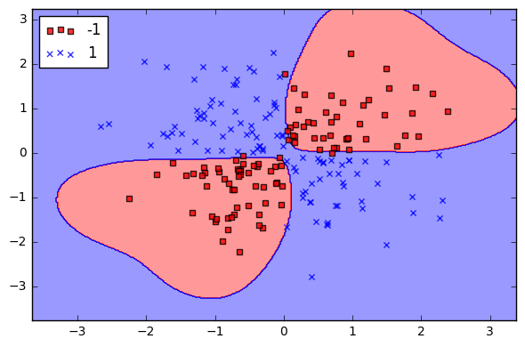

## Support Vector Machines

The two classifiers Nearest Neighbors and Logisitic Regression are simple and suffer from many limitations :

* kNN is very sensitive to noise and has to store all the training examples, which is unfeasible for very large datasets
* Logisitic Regression has a linear decision boundary : if the data is not linearly separable it can not succeed in classification. More over, all the training points contribute to the decision, even if they are far from the decision boundaries. 

Let's illustrate these points : (illustrations are [wikipedia in French](https://fr.wikipedia.org/wiki/Machine_%C3%A0_vecteurs_de_support))

First, let's suppose that we have only 2 classes (`+` and `-`) and that the data is linealy separable, which means that we can separate the 2 classes using a line (in 2 dimensions). 

  

Several separating lines are possible. Which one should we choose in order to minimize the error on the test set ? **The first idea** is to choose the line which is far from the points at the boundaries. 

  

This give a criterion to choose the best separating line based only on the points near the boundaries. The points which are far from the boundaries, and unambiuous, are not participating to the selection of the decision line. The points on which the decision line is built are called *support vectors* (points in circle on the illustration).

Second, let's suppose that the data are **not** linearly separable : 

  

On the illustration, the 2 classes can not be separated using a strait line. **The second idea** is to change the representation space of the data so that the classes are linearly separable. This usually done by choosing a representation space of higher dimensionality. The change of representation space is known as the *kernel trick*.

These two ideas are the basis of a familly of classifiers called Support Vector Machine, SVM (Séparateurs à Vaste Marge in French). These classifiers usually give very good results if they are well tuned.

We will now optimize a SVM classifier on the MNIST database. Create a new python script `mnist_svm.py` using the logger and the command line parser. 

**Question 10** : 
> * Train  SVM with a linear kernel on MNIST with the features previously computed (8x8 subresolution). Use [svm.SVC](http://scikit-learn.org/stable/modules/generated/sklearn.svm.SVC.html#sklearn.svm.SVC) with the option `kernel='linear'`
> Report the train and test error rate

 The linear kernel is very simple and does not need to optimize its hyper-parameters. This is not the case for more complex kernels such as polynomial or RBF kernels (see the [scikit-learn kernels documentation](http://scikit-learn.org/stable/modules/svm.html#svm-kernels) for their mathematical definition). 
 
The RBF kernel has two main parameters that must be optimized on the data : `C` and `gamma`.

`C` is a parameter common to all SVM classifier : it controls how many examples are allowed to be badly classified during the optimization. For small values of C, some training example are allowed to be misclassified if the margin  (the distance between the separating line and the support vector) is large. For large values of C, the algorithm tries to minimize the number of misclassified training example, even if it lead to a small margin. The impact of the value for C is shown on the following figure : 

  

 
`gamma` is a parameter controlling the *spread* of the RBF kernel : if `gamma` is large, the kernel takes into account many training samples and the decision boundary is smooth. When `gamma` is large, the kernel is focused on few training examples and the decision boundary is complex. The impact of `gamma` is illustrated on the following Figures : 

- `gamma` = 1

  

- `gamma` = 100

  

We will optimize a RBF kernel on MNIST.

**Question 11** : 
> * For the RBF kernel, the data must be normalized. Use the [StandardScaler](http://scikit-learn.org/stable/modules/generated/sklearn.preprocessing.StandardScaler.html) to scale *training data* to [zero mean and unit variance](https://en.wikipedia.org/wiki/Feature_scaling#Standardization).  
> Add an  option `--limit-samples` to limit the number of sample used for training/testing. In the following questions, limit the experiments to 2000 samples using   `--limit-samples 2000`. 
> * Split the data in 80% for training and 20% for testing.
> * Train a SVM classifier with a RBF kernel on MNIST with the features previously computed (8x8 subresolution). Use [svm.SVC](http://scikit-learn.org/stable/modules/generated/sklearn.svm.SVC.html#sklearn.svm.SVC) with the option `kernel='RBF'` with default values for `C` and `gamma`. Report its accuracy on the test set.
> * The `gamma` and `C` parameters must be optimized for the RBF kernel. Use [GridSearchCV](http://scikit-learn.org/stable/modules/generated/sklearn.model_selection.GridSearchCV.html) to find the best parameters for  `C in [0.5,1,5]` and `gamma in [0.05,0.1,0.5]`. Report the accuracy of the best model on the test set.

We have now trained a good classifier on the MNIST database. But is it good for handwritten digit recognition in general ?

**Question 12** : (optional)
> * Download the [USPS database](http://data.teklia.com/Images/USPS/USPS_Images.zip) and test your best classifier trained on MNIST on the USPS test set. Report the accuracy. Propose one or more solutions to improve this result and test them.

 
